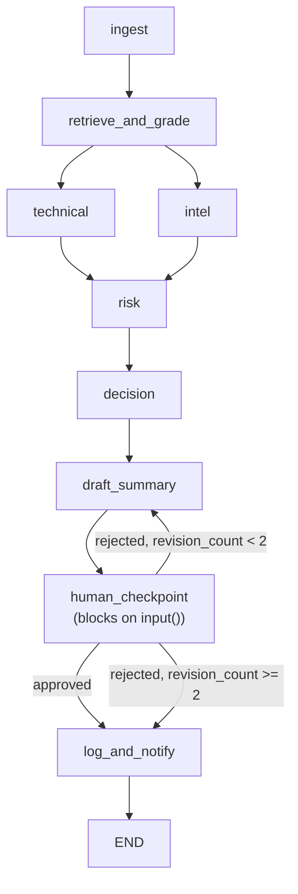
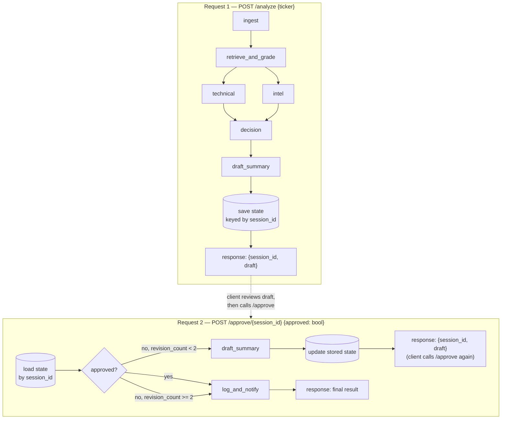

# Human checkpoint: CLI vs. API flow

For the technical/intel/risk/decision agent design upstream of the draft
shown here, see `docs/multi_agent_architecture.md` — this doc only covers
the human-approval step.

Design note for the `/chat` fix discussed for `app/main.py`. `run_pipeline()`
(via `agent/graph.py`'s `human_checkpoint_node`) blocks on a terminal
`input()` call for approval — fine for `python -m agent.graph AAPL`, but an
HTTP request has no terminal to block on. This splits the single
`human_checkpoint_node` into two API round-trips instead.

## Current: CLI flow (`agent/graph.py`, as built)

## API flow (`app/main.py`, as built)

Same nodes, same conditional-revision logic — `human_checkpoint_node`'s
`input()` is replaced by a stored draft that a second request approves or
rejects.

Between-request state lives in Redis (`app/session_store.py`), keyed by a
`session_id` UUID with a 30-minute TTL so abandoned sessions (draft shown,
never approved) don't accumulate forever. Only the JSON-serializable slice
of `AgentState` needed to resume — `ticker`, `price_summary`, `analysis`,
`draft`, `revision_count` — is stored; the Chroma vector store isn't
serializable and isn't needed past `draft_summary_node` anyway. Implemented
in `app/main.py` as `POST /analyze` (runs through `draft_summary_node`,
returns `{session_id, draft}`) and `POST /approve/{session_id}` (mirrors
`route_after_checkpoint`'s revision cap). Redis runs as its own service in
`docker-compose.yml`; locally, run `redis-server` and leave `REDIS_URL`
at its `.env.example` default.
