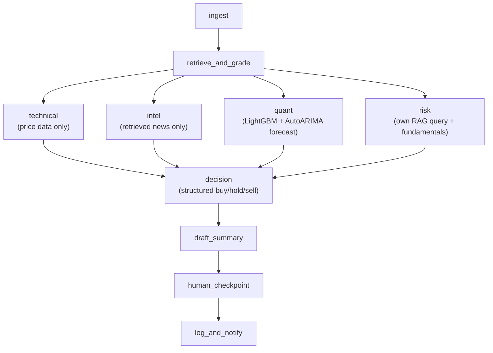

# Multi-agent architecture

How `agent/graph.py` turns one ticker into a buy/hold/sell call. For the
human-approval step specifically (CLI vs. API), see
`docs/human_checkpoint_flow.md` — this doc covers everything upstream of
that.

## Flow



`technical`, `intel`, `quant`, and `risk` all run in the same LangGraph
superstep — genuinely parallel, not just adjacent in the code — because
none of the four depends on any of the others' output. `decision` fans
in from all four.

Risk detection doesn't need the other three agents' conclusions to do
its job (see "Why risk doesn't need to run after the others" below), so
there's no reason to gate it behind them — four independent specialist
reads happen concurrently, one decision-maker synthesizes all four.

## What each node is responsible for

| Node | Reads | Does not read | Produces |
|---|---|---|---|
| `technical_node` | `price_summary`, `technical_indicators` (MA crossover, RSI, MACD, Bollinger width, volatility, volume change) | news, market data | `technical_analysis` (free text) |
| `intel_node` | `retrieved_context` (corrective-RAG news) | price data | `intel_analysis` (free text) |
| `quant_node` | trained LightGBM model + live feature row (see below) | news, LLM reasoning | `quant_signal` (`{probability_up, features}`, or `None` if untrained) |
| `risk_node` | its own risk-focused RAG query, fundamentals (P/E, P/B) | technical/intel/quant's conclusions | `risk_assessment` (`RiskAssessment`: list of `RiskFlag` + summary) |
| `decision_node` | all of the above | — | `decision` (structured `DecisionOutput`) + `analysis` (text, for `draft_summary_node`) |

`technical_node` and `intel_node` are deliberately scoped to *not* see
each other's domain — each is told explicitly not to reference the
other's kind of signal. `quant_node` is a different *kind* of signal
entirely — not an LLM call at all, see below. `decision_node` is where
all four reads get combined, and it's told to surface technical/intel
disagreement rather than silently picking a side.

## Why risk doesn't need to run after the others

An earlier version of this graph ran `risk_node` sequentially after
`technical`/`intel`/`quant`, feeding it their outputs as extra context,
on the theory that a risk agent needs to see what it might be
overriding. That reasoning doesn't hold up: insider activity, earnings
warnings, regulatory actions, and valuation anomalies are all detected
from `risk_node`'s *own* data sources (a targeted RAG query + a
fundamentals fetch) — none of that detection logic changes based on
what technical or intel concluded. And the actual "override other
agents' signals" behavior lives in `apply_risk_override()`, which runs
*after* `decision_node` and acts on the final combined `DecisionOutput`
— it never needed `risk_node` to have seen the others' intermediate
reads in the first place. So gating risk behind the other three bought
nothing but latency; running all four in parallel is strictly better.

## `quant_node` — a trained model, not an LLM call

Every other node in this graph is an LLM reasoning over data. `quant_node`
is different: it calls a **trained LightGBM classifier** (`ml/train.py`,
`ml/predict.py`) that predicts the probability of a positive 5-day
forward return, using:
- the same technical indicators `technical_node` sees (MA spread, RSI,
  MACD, Bollinger width, volatility, volume change), plus
- a **forecast from AutoARIMA** (Nixtla's `statsforecast`,
  `ml/autoarima_forecast.py`) as one more feature — a classical
  statistical model's forecasted 5-day return, fed into LightGBM
  alongside the hand-built indicators rather than used on its own.

This mixes two genuinely different ML approaches: LightGBM gives a
labeled, evaluable classification structure (a real train/test split,
accuracy/AUC you can report); AutoARIMA contributes whatever extra
signal an independent statistical forecast adds on top of the classical
indicators — cheaply, since it fits per-series in milliseconds to a few
seconds rather than requiring a pretrained model download.

**Train/serve skew, concretely addressed**: `ml/features.py`'s
`build_feature_row()` is the *only* place features are computed, called
identically by `ml/train.py` (building a historical panel, one row per
sampled past trading day) and `quant_node` (one row for "today"). Two
separate implementations — one for training, one for serving — is
exactly how train/serve skew creeps in; using the same function
guarantees it can't happen here.

**Leakage, concretely addressed**: `ml/train.py` splits train/test by
date (`TRAIN_TEST_SPLIT_DATE`), not a random shuffle. A random split
would let rows *after* the split date train a model evaluated on rows
*before* it — the model would effectively be evaluated on data it
implicitly saw the future of. A time-based split forces the test set to
be strictly later than everything the model trained on, matching how
the model is actually used (predicting forward, never backward).

`quant_node` returns `quant_signal=None` (not an error) if
`python -m ml.train` hasn't been run yet — every downstream node treats
a missing quant signal as "no opinion," not a failure.

## Why this is a pipeline, not a supervisor

`build_graph()` wires every edge with `graph.add_edge(...)` — the
sequence is fixed in code, not decided at runtime by an LLM. The only
conditional routing in the whole graph is `route_after_checkpoint`, and
that branches on a human's approve/reject decision plus a revision
counter, not on a model deciding which agent to call next.

A **supervisor** pattern would have a dedicated LLM node deciding, per
run, which of `technical`/`intel`/`quant`/`risk` to invoke, with workers
handing control back to the supervisor after each step. This project
doesn't need that: every run needs the same fixed set of signals (price
action, news, a quant model's read, risk) every time, so a static graph
is cheaper, easier to test, and easier to debug (a failure is always
"stage X broke," never "the supervisor routed to the wrong agent").
Supervisor-style dynamic routing would earn its complexity if different
requests legitimately needed different subsets of agents — this project
doesn't have that variation.

## Final output — `DecisionOutput`

```python
DECISION_LEVELS = ["strong_sell", "sell", "hold", "buy", "strong_buy"]

class PriceRange(BaseModel):
    low: float
    high: float

class DecisionOutput(BaseModel):
    decision: Literal["strong_buy", "buy", "hold", "sell", "strong_sell"]
    buy_range: Optional[PriceRange]   # entry price band, if the analysis supports one
    sell_range: Optional[PriceRange]  # exit/take-profit price band, if supported
    rationale: str
```

Produced via `with_structured_output`, not parsed out of free text — the
rating and price ranges are always machine-readable, not something that
has to be scraped out of prose. `state["decision"]` (this dict, plus a
`risk_level` key merged in by `decision_node`) is what `POST /analyze`
returns alongside the draft, and what `draft_summary_node` is told to
state explicitly rather than hedge around.

## Risk override — two-level severity

`risk_node` can emit `RiskFlag`s with `severity` of:
- **soft** — downgrades the decision one level on `DECISION_LEVELS`
  (e.g. `strong_buy` → `buy`) and adds a visible warning to `rationale`.
- **hard** — forces the decision down to at most `sell`, *if*
  `RISK_OVERRIDE_ENABLED` (env var, default `true`) — a hard risk finding
  should read as "high risk, sell," not a neutral "hold."

Both are no-ops once the decision is already at the relevant floor
(`strong_sell` for soft, `sell`/`strong_sell` for hard) — there's nothing
further to downgrade or veto. `risk_level` (`low`/`medium`/`high`,
surfaced alongside `decision` for display) is a **deterministic lookup**
from the flags' severities via `compute_risk_level()` — not an LLM
judgment call, since `RiskFlag.severity` already encodes exactly this.

Both the override and the risk-level lookup are applied by
`apply_risk_override()`/`compute_risk_level()` **after** `decision_node`'s
LLM call, not inside the prompt — guaranteed by code, not something the
model is merely asked to remember to apply.

## Known simplifications (staged — not gaps to be surprised by)

- `technical_node` uses real indicators now (MA crossover, RSI, MACD,
  Bollinger Band width, 20-day volatility, volume change — computed in
  `data/ingest_prices.py`'s `fetch_technical_indicators`, not by the
  LLM). Support/resistance levels specifically are still not computed —
  only the crossover/RSI/MACD/volatility signals above.
- `intel_node` only searches single-ticker news; no SPY/QQQ market-wide
  context yet.
- `risk_node`'s insider-activity and lock-up-expiration checks ride on
  the same general news-embedding search as `intel_node` — if a risk
  never showed up in that search, it won't be flagged. A production
  version would want a dedicated feed (e.g. SEC Form 4 filings) instead
  of hoping the risk surfaces in a news search.
- `ml/train.py` pools only `STOCK_LIST` (2 tickers by default) over 5
  years, sampled every 5th day — a real quant setup would train on far
  more tickers and more history. `ml/autoarima_forecast.py` runs
  AutoARIMA with default settings (no explicit seasonal period, no
  exogenous regressors) — a reasonable default for daily stock closes,
  but a real deployment might tune the search space or add regressors
  (e.g. sector index level) if it improved held-out accuracy.
