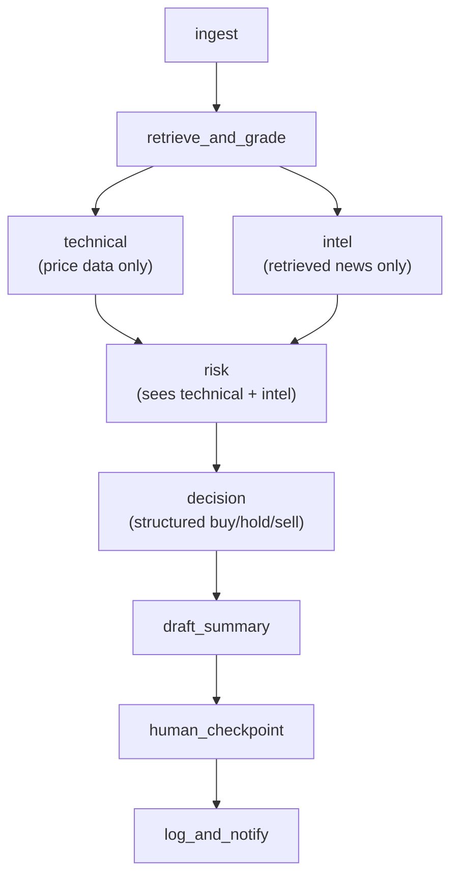

# Multi-agent architecture

How `agent/graph.py` turns one ticker into a buy/hold/sell call. For the
human-approval step specifically (CLI vs. API), see
`docs/human_checkpoint_flow.md` — this doc covers everything upstream of
that.

## Flow



`technical` and `intel` run in the same LangGraph superstep — genuinely
parallel, not just adjacent in the code — because neither depends on the
other's output. `risk` fans in from both (it needs their reads to know
what it might be overriding) before `decision` runs.

## What each node is responsible for

| Node | Reads | Does not read | Produces |
|---|---|---|---|
| `technical_node` | `price_summary` | news, market data | `technical_analysis` (free text) |
| `intel_node` | `retrieved_context` (corrective-RAG news) | price data | `intel_analysis` (free text) |
| `risk_node` | `technical_analysis`, `intel_analysis`, a risk-focused RAG query, fundamentals (P/E, P/B) | — | `risk_assessment` (`RiskAssessment`: list of `RiskFlag` + summary) |
| `decision_node` | all of the above | — | `decision` (structured `DecisionOutput`) + `analysis` (text, for `draft_summary_node`) |

`technical_node` and `intel_node` are deliberately scoped to *not* see
each other's domain — each is told explicitly not to reference the
other's kind of signal. `decision_node` is the only place the two reads
get combined, and it's told to surface disagreement between them rather
than silently picking a side.

## Why this is a pipeline, not a supervisor

`build_graph()` wires every edge with `graph.add_edge(...)` — the
sequence is fixed in code, not decided at runtime by an LLM. The only
conditional routing in the whole graph is `route_after_checkpoint`, and
that branches on a human's approve/reject decision plus a revision
counter, not on a model deciding which agent to call next.

A **supervisor** pattern would have a dedicated LLM node deciding, per
run, which of `technical`/`intel`/`risk` to invoke and in what order,
with workers handing control back to the supervisor after each step.
This project doesn't need that: every run needs the same fixed set of
signals (price action, news, risk) in the same order, so a static graph
is cheaper, easier to test, and easier to debug (a failure is always
"stage X broke," never "the supervisor routed to the wrong agent").
Supervisor-style dynamic routing would earn its complexity if different
requests legitimately needed different subsets of agents — this project
doesn't have that variation.

## Final output — `DecisionOutput`

```python
class DecisionOutput(BaseModel):
    decision: Literal["buy", "hold", "sell"]
    price_target: Optional[float]
    rationale: str
```

Produced via `with_structured_output`, not parsed out of free text — the
buy/hold/sell signal and price target are always machine-readable.
`state["decision"]` (this, as a dict) is what `POST /analyze` returns
alongside the draft.

## Risk override — two-level severity

`risk_node` can emit `RiskFlag`s with `severity` of:
- **soft** — downgrades a `buy` to `hold` and adds a visible warning to
  `rationale`.
- **hard** — vetoes a `buy` down to `hold` outright, *if*
  `RISK_OVERRIDE_ENABLED` (env var, default `true`).

This is enforced by `apply_risk_override()` **after** `decision_node`'s
LLM call, not inside the prompt — the override is guaranteed by code,
not something the model is merely asked to remember to apply. Non-buy
decisions (`hold`/`sell`) pass through unchanged; there's nothing to
downgrade or veto in those.

## Known simplifications (staged — not gaps to be surprised by)

- `technical_node` reasons over `price_summary`'s 5-day % change, not
  real moving averages / support-resistance levels yet.
- `intel_node` only searches single-ticker news; no SPY/QQQ market-wide
  context yet.
- `risk_node`'s insider-activity and lock-up-expiration checks ride on
  the same general news-embedding search as `intel_node` — if a risk
  never showed up in that search, it won't be flagged. A production
  version would want a dedicated feed (e.g. SEC Form 4 filings) instead
  of hoping the risk surfaces in a news search.
